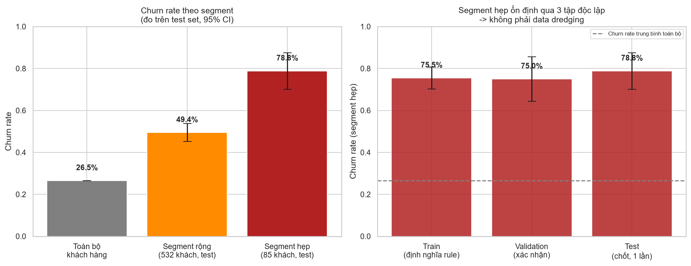
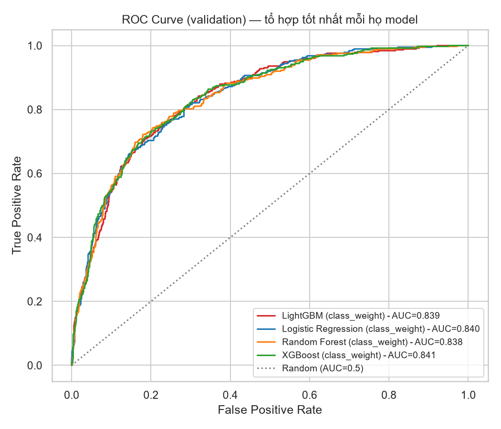
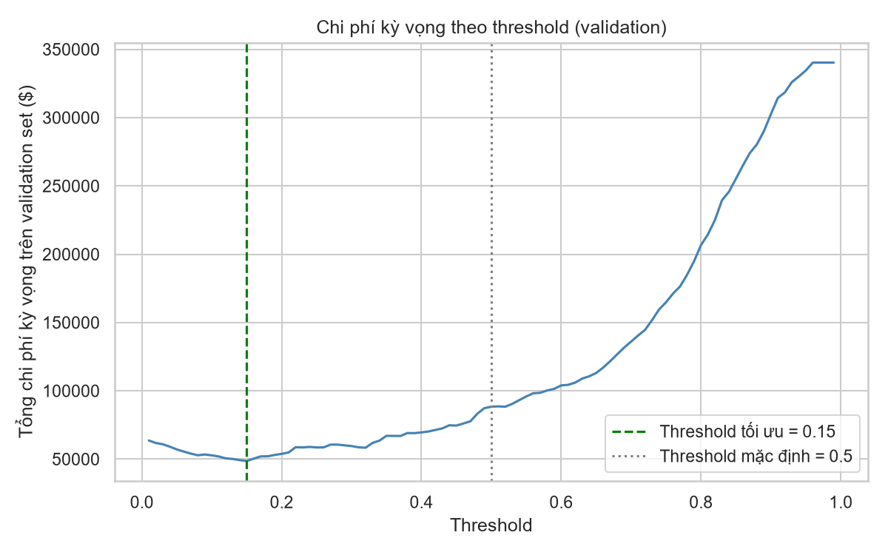
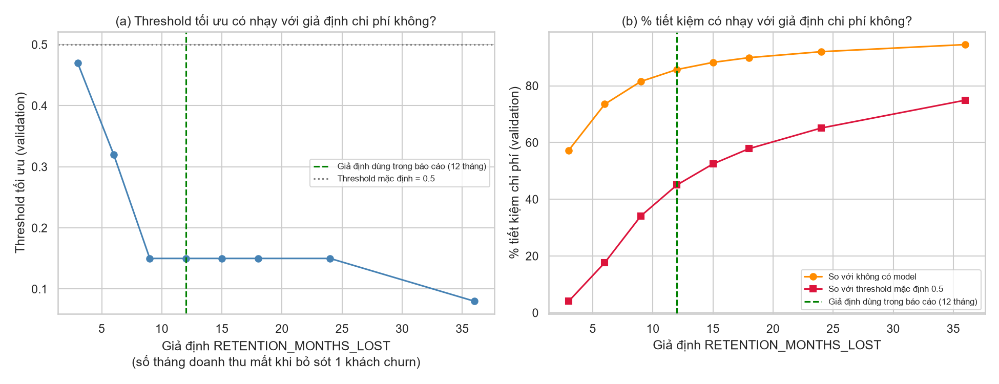
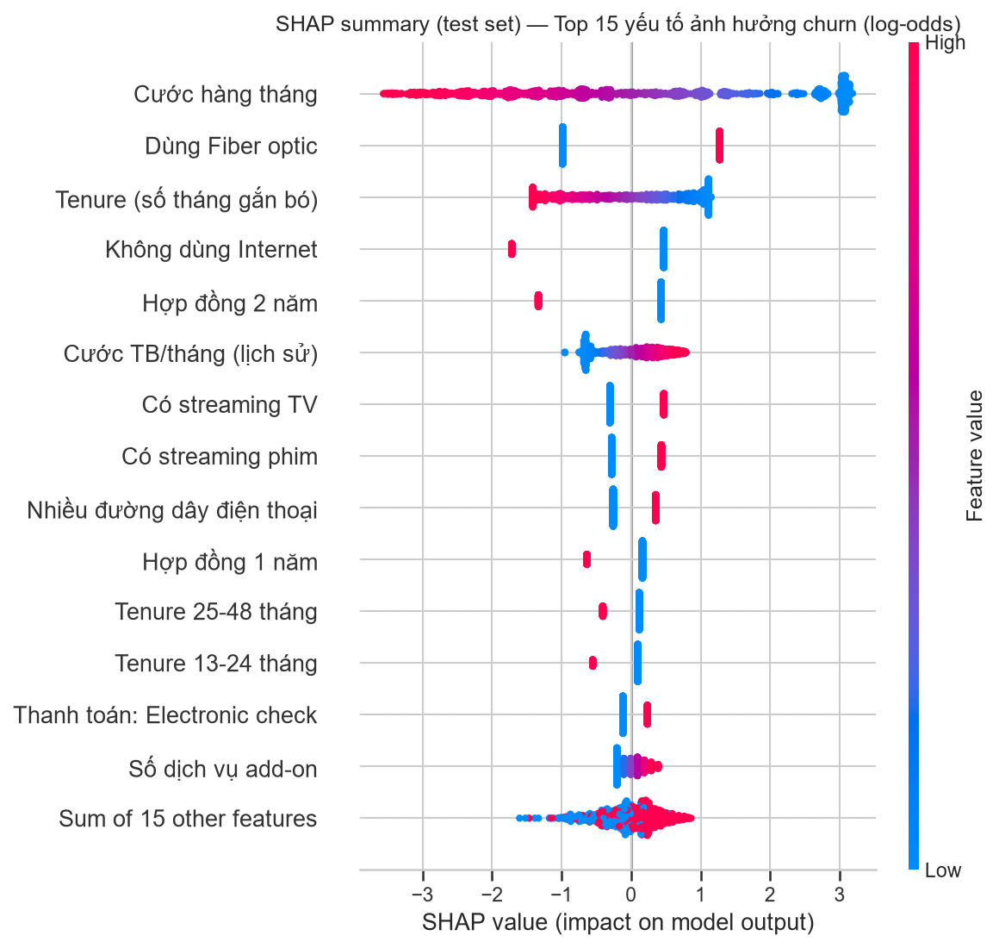

# Telco Customer Churn: Dự đoán khách hàng rời bỏ

Công ty viễn thông mất doanh thu khi khách hàng rời bỏ dịch vụ, và giữ chân khách hàng
hiện tại thường rẻ hơn nhiều so với thu hút khách mới. Dự án dự đoán xác suất churn, xác
định nhóm khách hàng rủi ro cao, và đề xuất chiến lược giữ chân dựa trên phân tích chi phí,
có giải thích mô hình bằng SHAP.

## Kết quả nổi bật

- Nhóm 410 khách hàng (5,8% tổng) có tỷ lệ churn 76-79%, gấp gần 3 lần mức trung bình
  26,5%. Đã kiểm chứng độc lập trên 3 tập dữ liệu, có thể xuất thẳng thành danh sách ưu
  tiên cho đội CSKH.
- Logistic Regression đạt ROC-AUC 0,8452 trên test set, tốt nhất trong các mô hình so
  sánh.
- Ngưỡng dự đoán chọn theo chi phí thực tế thay vì mặc định 0,5, tiết kiệm ước tính 84,7%
  chi phí so với không dùng mô hình, 35,9% so với ngưỡng mặc định.
- SHAP cho biết lý do đằng sau mỗi dự đoán, xác nhận lại đúng những yếu tố đã tìm thấy ở
  bước phân tích dữ liệu ban đầu.



Bản tóm tắt kinh doanh: [`reports/business_summary.md`](reports/business_summary.md).

## Dataset

[Telco Customer Churn (Kaggle)](https://www.kaggle.com/datasets/blastchar/telco-customer-churn),
~7.043 khách hàng, 21 cột (hợp đồng, dịch vụ sử dụng, thanh toán, nhãn `Churn`).

## Phương pháp & kết quả mô hình

Tách dữ liệu train, validation, test (60/20/20), so sánh 8 tổ hợp (4 mô hình x 2 cách xử
lý mất cân bằng dữ liệu), chọn tổ hợp tốt nhất trên validation. Test set chỉ chạm đúng 1
lần để xác nhận kết quả, tránh dùng chung 1 tập vừa chọn mô hình vừa báo cáo.

Mô hình cao điểm nhất (XGBoost, 0,8408) chỉ nhỉnh hơn Logistic Regression (0,8396) một
chút, không đủ tin cậy để kết luận XGBoost thực sự tốt hơn. Chọn Logistic Regression làm
mô hình cuối vì đơn giản hơn và dễ giải thích.

| Chỉ số | Giá trị |
|---|---|
| Mô hình tốt nhất | Logistic Regression |
| ROC-AUC (validation / test) | 0,8396 / **0,8452** |
| Ngưỡng dự đoán tối ưu theo chi phí | **0,15** (thay vì mặc định 0,5) |
| Precision / Recall (test, ngưỡng 0,15) | 0,38 / 0,98 |
| Tiết kiệm chi phí so với không dùng mô hình | **84,7%** |
| Tiết kiệm chi phí so với ngưỡng mặc định | **35,9%** |




### Giả định chi phí có làm thay đổi kết luận không?

Chi phí bỏ sót 1 khách churn (giả định 12 tháng cước) là giả định kinh doanh, đã kiểm tra
bằng cách quét tỷ lệ chi phí từ 3:1 đến 36:1 trên validation set:



- Ngưỡng tối ưu ổn định ở 0,15 trong khoảng tỷ lệ 9:1-24:1, giả định gốc (12:1) nằm giữa
  khoảng này, không phải một điểm may rủi ở rìa.
- Kết luận "nên dùng ngưỡng thấp hơn hẳn 0,5" vững qua toàn bộ khoảng khảo sát 3:1-36:1.
  Ở kịch bản bi quan nhất, tiết kiệm so với không dùng mô hình vẫn dương và lớn
  (57,1%-94,5%).
- Chỉ con số tiết kiệm cụ thể nhạy với giả định, dao động 4,1%-74,9%. Nên đọc 84,7%/35,9%
  như ước tính, không phải con số cố định.

**SHAP:** top yếu tố ảnh hưởng churn là cước hàng tháng, dùng Fiber optic, thời gian gắn
bó, không dùng Internet, hợp đồng 2 năm. Top 5 này khớp qua 3 cách phân tích độc lập, và
SHAP còn cho biết hướng tác động của từng yếu tố, giải thích được dự đoán cho từng khách
hàng cụ thể.



### Xác thực nhóm rủi ro cao

Nhóm 410 khách hàng được tìm ra bằng cách kết hợp các yếu tố rủi ro mạnh nhất phát hiện ở
bước khám phá dữ liệu (EDA), xác thực theo đúng nguyên tắc train/validation/test:

| Tập | Vai trò | n | Churn rate |
|---|---|---|---|
| Train | Định nghĩa rule | 261 | 75,5% |
| Validation | Xác nhận (không tinh chỉnh thêm) | 64 | 75,0% |
| Test | Chốt, chạm đúng 1 lần | 85 | **78,8%** (95% CI 70,1%-87,5%) |

Tỷ lệ churn ổn định qua cả 3 tập, cho thấy đây là tín hiệu thật chứ không phải khớp may
rủi. Áp dụng rule này lên toàn bộ 7.043 khách hàng cho ra danh sách 410 khách cần ưu tiên.

## Đề xuất kinh doanh

1. Chủ động giữ chân khách hợp đồng theo tháng trong 3 tháng đầu (nhóm mới dùng dưới 6
   tháng có tỷ lệ churn 52,9%) bằng ưu đãi 1 tháng cước miễn phí đổi cam kết hợp đồng 1
   năm.
2. Ưu tiên cao nhất: 410 khách hàng khớp đủ 4 điều kiện rủi ro (hợp đồng theo tháng, dùng
   Fiber optic, thanh toán Electronic check, mới dùng dưới 6 tháng), tỷ lệ churn 76-79%.
   Rà soát chất lượng dịch vụ Fiber optic, khuyến khích chuyển sang thanh toán tự động.
3. Upsell dịch vụ bảo mật/hỗ trợ kỹ thuật cho khách cước cao, ít dùng thêm dịch vụ. Vừa
   tăng doanh thu vừa giảm rủi ro churn.
4. Áp dụng đúng ngưỡng 0,15 khi triển khai thực tế, không dùng mặc định 0,5.

## Giới hạn của phân tích

- Kết quả dựa trên 1 lần chia dữ liệu cố định, có thể dao động đôi chút tuỳ cách chia với
  ~7.000 dòng dữ liệu.
- Chênh lệch ROC-AUC giữa XGBoost và Logistic Regression là nhỏ, không đủ căn cứ thống kê
  để khẳng định XGBoost vượt trội, nên vẫn giữ nguyên lựa chọn ban đầu.
- Giả định chi phí đơn giản hoá (12 tháng cước cho trường hợp bỏ sót, 1 tháng cước cho
  trường hợp can thiệp nhầm). Đã kiểm tra độ nhạy, nhưng chưa tính giá trị vòng đời khách
  hàng, chiết khấu dòng tiền, hay chi phí vận hành khi triển khai quy mô lớn.
- SHAP dùng giả định các yếu tố độc lập, đủ tin cậy để xếp hạng mức độ quan trọng và hướng
  tác động, nhưng không nên xem từng con số SHAP như một mức chi phí/lợi ích chính xác.
- Nhóm rủi ro cao có số lượng khách khá nhỏ ở validation/test (64/85 khách), nên khoảng
  tin cậy khá rộng.
- Ngưỡng 0,15 ưu tiên bắt nhiều khách sắp churn (recall 0,98), đổi lại precision thấp
  (0,38): cứ khoảng 2,6 khách bị gắn cờ thì có 1 khách thực sự sắp churn. Khi triển khai
  thật cần thêm giới hạn ngân sách/số lượng khách liên hệ mỗi tháng.

## Cấu trúc thư mục
```
telco-churn-prediction/
├── data/
│   ├── raw/            # dữ liệu gốc tải từ Kaggle (không commit)
│   └── processed/      # dữ liệu đã xử lý (train/val/test)
├── models/              # model cuối đã chọn (best_model.joblib)
├── notebooks/           # 01_eda -> 02_feature_engineering -> 03_modeling -> 04_explainability
├── src/                 # code tái sử dụng (features.py, evaluation.py)
├── reports/
│   ├── figures/         # biểu đồ xuất ra cho báo cáo
│   └── business_summary.md  # tóm tắt kinh doanh ngắn gọn
├── PROGRESS.md          # nhật ký tiến độ theo ngày
├── requirements.txt
└── README.md
```

## Kế hoạch 7 ngày
| Ngày | Nội dung | Notebook |
|---|---|---|
| 1 | Xác định bài toán, tải data, EDA sơ bộ | `01_eda.ipynb` |
| 2 | EDA sâu theo từng phân khúc khách hàng | `01_eda.ipynb` |
| 3 | Feature engineering, xử lý imbalance | `02_feature_engineering.ipynb` |
| 4 | Modeling: Logistic Regression, RF, XGBoost, LightGBM | `03_modeling.ipynb` |
| 5 | Đánh giá mô hình, ma trận chi phí, chọn threshold | `03_modeling.ipynb` |
| 6 | SHAP explainability, đề xuất hành động | `04_explainability.ipynb` |
| 7 | Tổng hợp báo cáo, hoàn thiện README | `reports/`, `README.md` |

Chi tiết đầy đủ theo từng ngày xem tại [`PROGRESS.md`](PROGRESS.md).

## Cách chạy
```bash
# Kích hoạt virtual environment
source .venv/Scripts/activate   # Git Bash trên Windows

# Cấu hình Kaggle API (xem phần Setup Kaggle bên dưới), sau đó tải data
kaggle datasets download -d blastchar/telco-customer-churn -p data/raw --unzip

# Chạy notebook theo thứ tự: 01_eda -> 02_feature_engineering -> 03_modeling -> 04_explainability
jupyter notebook
```

## Setup Kaggle API
1. Đăng nhập Kaggle → vào **Account** (kaggle.com/settings) → mục **API** → **Create New Token**.
2. File `kaggle.json` sẽ tải về, chứa `username` và `key`.
3. Đặt file vào `C:\Users\<user>\.kaggle\kaggle.json` (Windows), tạo thư mục `.kaggle` nếu chưa có.
4. Không commit file này (đã có trong `.gitignore`).
